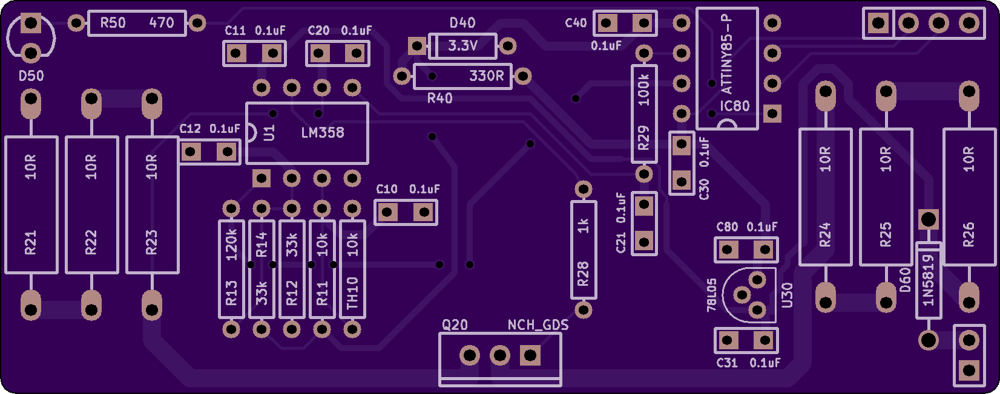

# 1590b-isothermal

A "daughter board" which attaches to the bottom of a Hammond 1590B and regulates its temperature at 25C.

- [schematic](kicad/releases/v1/isothermal.pdf)
- [gerber files](kicad/releases/v1)
- [OSHPark link](https://oshpark.com/projects/2yNYiLGr)

The resistor values were chosen to map a 20C to 30C window onto (roughly) 0V to 3.3V.

See also [this link](https://github.com/cellularmitosis/logs/tree/master/20180126-25c-chamber-tuning) for PID tuning and measurements of a similar design (based on MCP9701 rather than thermistors).

